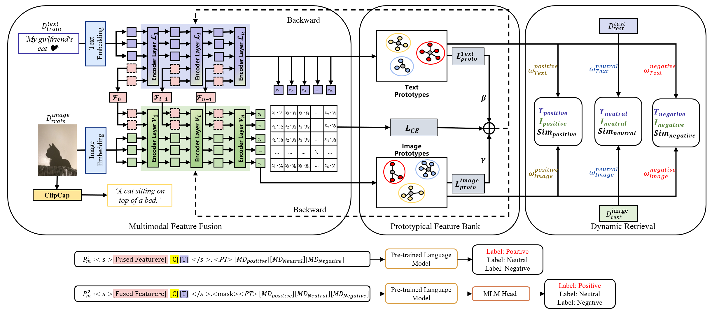

# MAPLE-Net: Multimodal Affect Perception with Large Language model Enhancement Network

## Overview



The figure shows the architectures of  our MAPLE-Net approaches for MSA tasks. 

## Requirements

Use
>pip install -r requirments

to install requiremenrts

## Prepare the data

You can download the datasets from the original links below and preprocess the data following the scrips in `datasets_pre_processing`.

>**Original links**
>
>COCO2014: [`train2014.zip`](http://images.cocodataset.org/zips/train2014.zip) and [`val2014.zip`](http://images.cocodataset.org/zips/val2014.zip) from https://cocodataset.org
>
>Twitter-15 and Twitter-17: [`IJCAI2019_data.zip`](https://drive.google.com/file/d/1PpvvncnQkgDNeBMKVgG2zFYuRhbL873g/view) from https://github.com/jefferyYu/TomBERT
>
>MASAD: [`MASAD.zip`](https://drive.google.com/file/d/19YJ8vEYCb-uEKUqSGFmysUTvNzxhVKFE/view?usp=sharing) from https://github.com/12190143/MASAD
>
>MVSA-S and MVSA-M: [`MVSA-Single.zip`](https://portland-my.sharepoint.com/:u:/g/personal/shiaizhu2-c_my_cityu_edu_hk/Ebcsf1kUpL9Do_u4UfNh7CgBC19i6ldyYbDZwr6lVbkGQQ) and [`MVSA-multiple.zip`](https://portland-my.sharepoint.com/:u:/g/personal/shiaizhu2-c_my_cityu_edu_hk/EV4aaLrE-nxGs4ZNyZ8J_o8Bj6hui-PnU-FKYtG7S5r_xQ) from http://mcrlab.net/research/mvsa-sentiment-analysis-on-multi-view-social-data
>
>TumEmo: [`all_data_id_and_label.txt`](https://pan.baidu.com/s/1O8GmVGCDp_XRftSdEBLghQ) (access code `9hh1`) and [`all_data.zip`](https://pan.baidu.com/s/1F5d1urf67-yaSy-tcsS_4A) (access code `88il`) from https://github.com/YangXiaocui1215/MVAN

The UP models we used can be found [here](https://pan.baidu.com/s/1Pwq0_MPcM7GSsiaCXBFlgg?pwd=hvli).


### Quick start

```shell
nohup python -m src.test_model > log/t2015/output_test_few112.log 2>&1 &
```
The test results, including accuracy (ACC) and F1 scores, will be saved as .log files under the directory log/<dataset>. The corresponding plots, illustrating the ACC and F1 score trends as well as loss changes, will be saved as .png files in the directory plots/<dataset>.

We have provided example results for the datasets MVSA_S and MASAD. Below are sample results for the MVSA_S dataset:


